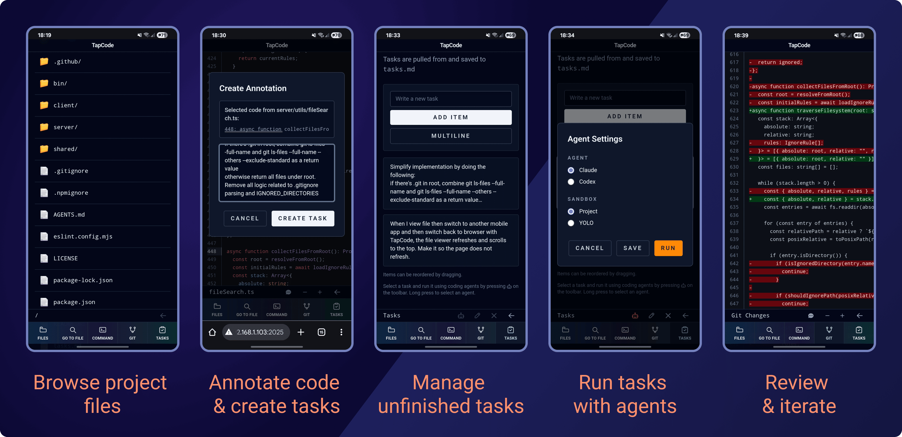
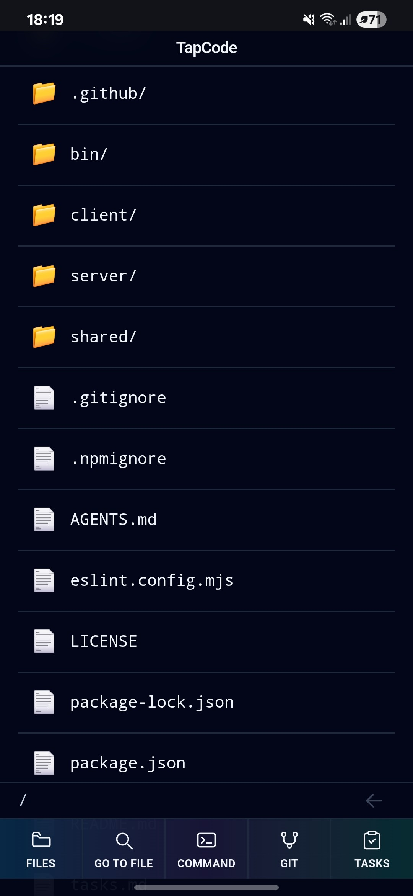
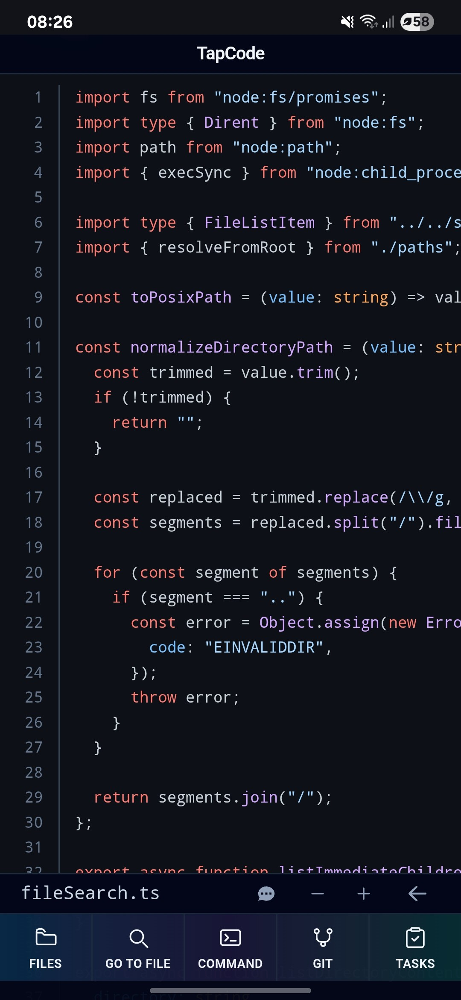
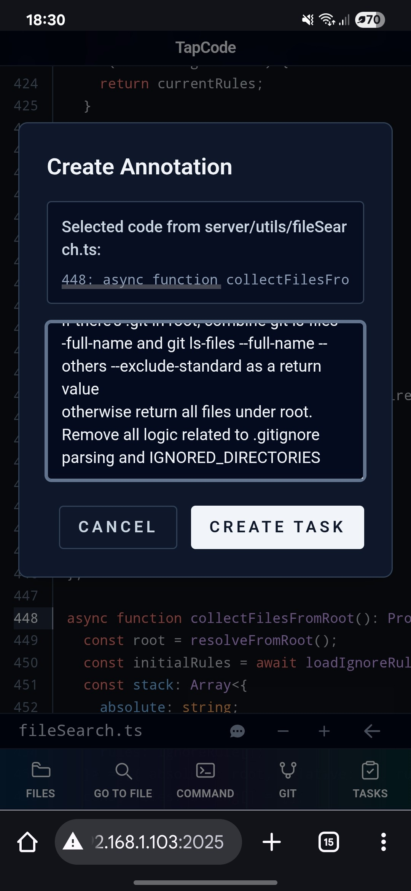
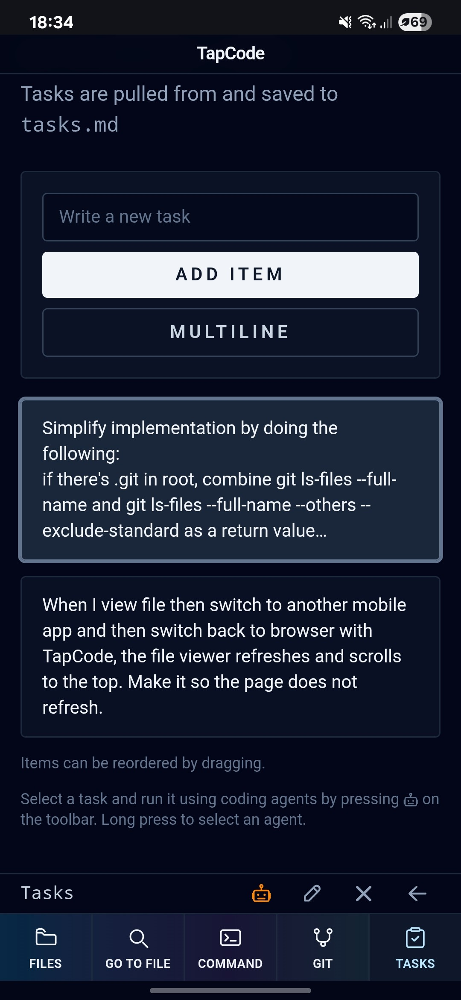
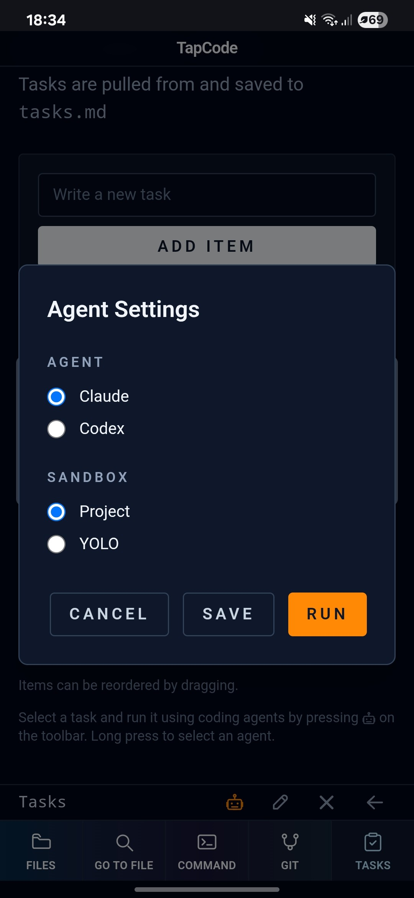
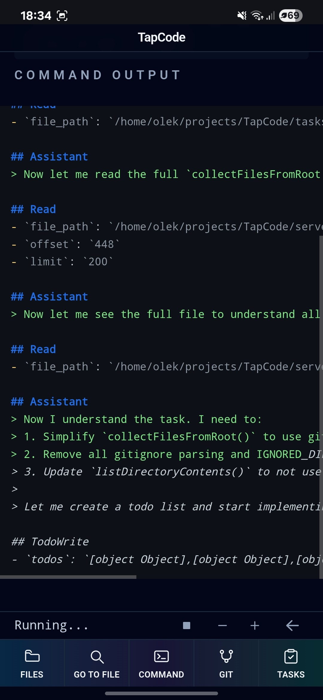
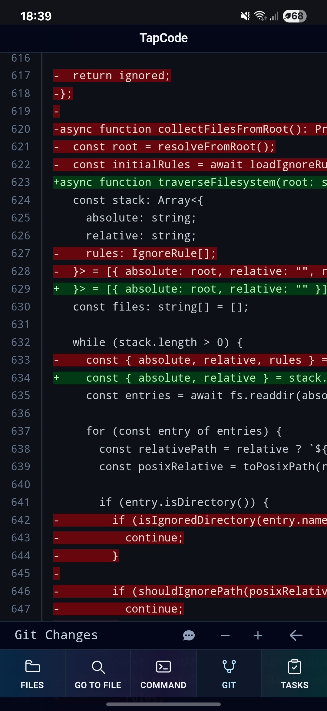
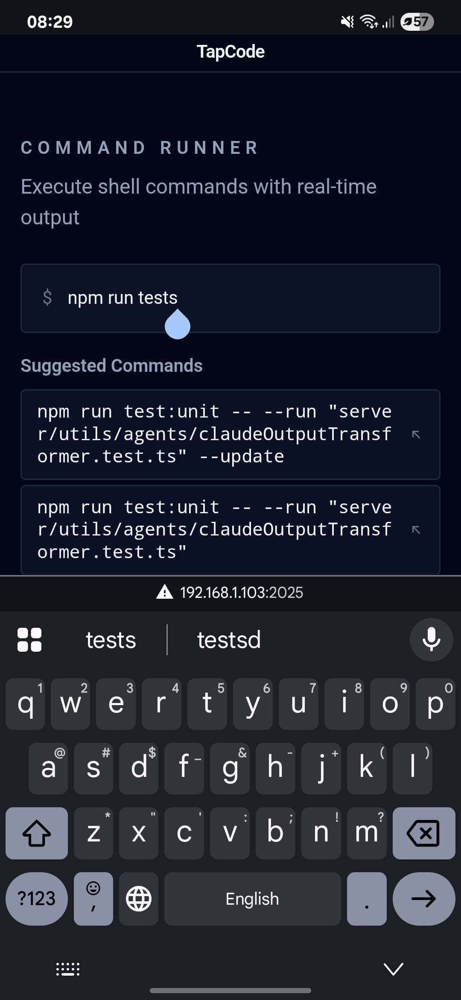

<div align="center">

# TapCode

_Waste no time, code anytime_

</div>



## Table of Contents

- [What is TapCode?](#what-is-tapcode)
- [Features](#features)
- [Install](#install)
- [Workflow](#workflow)
- [Configure](#configure)
- [Support](#support)
- [Contributing](#contributing)
- [License](#license)

## What is TapCode

✔ A developer interface to a programming environment running on your laptop/Cloud server/RaspberryPI/etc. <br />
✔ A mobile-first programming interface that focuses on AI-assisted coding. <br />
✔ A task-oriented coding workflow where developers create tasks, run them using coding agents, review code, and continue iterating until the desired result. <br />
✔ A web-based interface that allows creating tasks for AI agents, running CLI commands, browsing code, and doing basic GIT operations. <br />
✔ A lightweight client-server NodeJS application written with TypeScript, Express, Vite, React, and TailwindCSS. <br />

**What it is NOT:**

❌ A code editor or IDE replacement: TapCode doesn't provide file editing capabilities at all. <br />
❌ A full-featured AI coding assistant: TapCode focuses on task-based coding. It currently does not support interactive chat with AI agents (it might be added in the future). <br />
❌ A cloud service: TapCode runs locally on your machine, ensuring your code and data remain private. <br />

## Features

TapCode helps developers code effectively from smartphones by pairing them with coding agents.

**Mobile-First Development**: Programming workflow optimized for smartphone screens. SSH terminal might be required for more complex tasks <br />

**Project File Browsing**: Navigate and view project files in a mobile-friendly way with code syntax highlighting <br />

**Task-Oriented Approach**: Easily annotate code and create coding tasks for AI agents <br />

**Task Execution With Coding Agents**: Currently only `Claude Code` and `OpenAI Codex` agents are supported in _non-interactive_ mode. <br />

**Basic GIT Operations**: View git status, diff, stage & commit changes <br />

**Web-Based Interface**: Review generated code from your mobile web browser, execute CLI command tasks using agents <br />

**Runs Locally Or In The Cloud**: Run it on your home machine -> at night -- when you dreamed of a new feature -- pick up a phone and start TapCoding. You can also program on the go if you run TapCode on a cloud VM. <br />

---

## Install

Install TapCode globally via npm:

```bash
npm install -g tapcode

# then run by specifying the project directory
tapcode /path/to/your/project
```

Or run directly without installation using npx:

```bash
npx tapcode .
```

**Requirements:**

- Node.js >= 18

## Workflow

| Step                                                               | Description                                                                                                                                                                                                                                |
| ------------------------------------------------------------------ | ------------------------------------------------------------------------------------------------------------------------------------------------------------------------------------------------------------------------------------------ |
|                  | Use the file browser or the global search to quickly locate files in your repository.                                                                                                                                                      |
|                 | Open the file viewer to inspect syntax-highlighted code before creating edits.                                                                                                                                                             |
|                     | Click on the line numbers in the gutter to add them to the annotation context and then on the annotation button on the toolbar.                                                                                                            |
|          | From the task list, select a task and tap the 🤖 icon on the toolbar to hand off your request to a coding agent.                                                                                                                           |
|                 | Long press the 🤖 icon to select between Claude Code or OpenAI Codex. They will run <b>non-interactively</b>. If you want to do a planning first, define a task to save the plan to a file and then create a new task to execute the plan. |
|     | Follow real-time terminal logs as the selected agent executes commands and edits your codebase.                                                                                                                                            |
|        | Inspect the resulting diffs and code previews to confirm the agent's changes are correct. <br /> Create new annotations from here if you want to make changes.                                                                             |
|  | Run any follow-up shell commands directly from the app to continue iterating on the task.                                                                                                                                                  |

---

## Configure

By default the server will starts on `http://127.0.0.1:2025`.

Configure TapCode using environment variables:

| Variable             | Description                                          | Default     |
| -------------------- | ---------------------------------------------------- | ----------- |
| `TAPCODE_HOST`       | Network interface the server binds to                | `127.0.0.1` |
| `TAPCODE_PORT`       | Port the server listens on                           | `2025`      |
| `TAPCODE_BASIC_AUTH` | Enable HTTP Basic Auth (format: `username:password`) | disabled    |

> **Security Note**: Basic auth does not encrypt traffic. Use it only over secure networks or keep the default host name and forward via SSH tunnel.

**Example:**

```bash
export TAPCODE_HOST=0.0.0.0  # will listen on all interfaces
export TAPCODE_PORT=3000
export TAPCODE_BASIC_AUTH=username:secretpassword
tapcode .
```

---

## Support

We'd love your support and contributions to make TapCode better!

### Give a Star

If you find TapCode useful, please give us a star on GitHub:

⭐ [Star TapCode on GitHub](https://github.com/gornostal/TapCode)

### Report a Bug

Found a bug? Please create an issue:

🐛 [Report Bug](https://github.com/gornostal/TapCode/issues/new)

### Start a Discussion

Have questions or ideas? Join the discussion:

💬 [GitHub Discussions](https://github.com/gornostal/TapCode/discussions)

---

## Contributing

We welcome contributions from the community!

### Code Contributions

**Bug Fixes:**

Feel free to submit pull requests for bug fixes directly

**Features & Improvements:**

‼ Please start a **discussion** first before implementing new features. This helps ensure alignment with project goals and prevents duplicate work

---

## License

TapCode is licensed under the [Apache License 2.0](LICENSE).

---

_Made with ❤️ for developers who code in their sleep and on the go_
