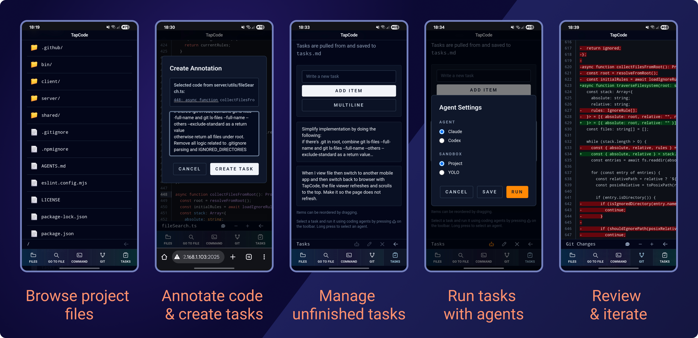
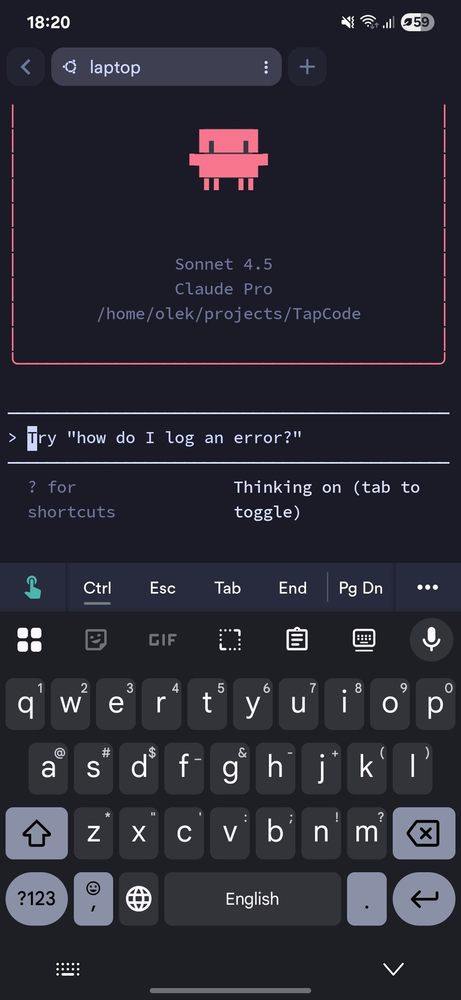

# Claude Code Remote Control + TapCode: the best way to code from your phone

Claude Code just released a feature called [Remote Control](https://docs.anthropic.com/en/claude-code/remote-control) (as of March 1st, 2026). It's a research preview, but it already changes what's possible when coding on a smartphone.

Let me explain what it is, where it falls short, and how combining it with TapCode fills the gap.

## What is Remote Control?

Remote Control lets you continue a local Claude Code session from any browser or the Claude mobile app. Your agent keeps running on your laptop or server — nothing moves to the cloud. You just get a live window into it from your phone.

Starting it is one command:

```bash
claude remote-control
```

The terminal shows a session URL and a QR code. Scan the code, open it in the Claude app, and you're in. Send messages from your phone, the laptop, or both — the conversation stays in sync.

You can also enable it from inside an existing Claude Code session:

```
/remote-control
```

Read the full official documentation here: [Continue local sessions from any device with Remote Control](https://docs.anthropic.com/en/claude-code/remote-control)

## Good for instructions. Not enough on its own.

The Remote Control interface is great for typing prompts. No SSH, no terminal quirks, no fighting with special characters on a mobile keyboard. You describe what you want, hit send, and Claude Code gets to work back on your machine.

But here's the problem.

After the agent runs, you need to review what it did. The Remote Control/claude.ai interface isn't built for that. There's no file tree, no syntax-highlighted diff, no way to tap through changed files to spot what went wrong or what looks off.

Reviewing generated code in a chat interface on a 6-inch screen is painful.

## The fix: use TapCode for code review

[TapCode](https://github.com/gornostal/TapCode) is a mobile-first web UI that runs alongside your coding agent. It's built exactly for what Remote Control lacks.

[](https://github.com/gornostal/TapCode)

Once TapCode is running, open it in your phone browser. You get:

- A file explorer to navigate your project
- Syntax-highlighted code previews
- Git diff viewer to inspect exactly what changed
- A task list view for managing what you want done next

While Claude Code handles the coding via Remote Control, TapCode handles the review. They complement each other perfectly.

## Annotating code → creating tasks → back to Remote Control

Here's where the workflow gets interesting.

TapCode lets you annotate specific lines of code. Tap a line number in the gutter, add a comment, and it builds a task with full context — the file, the lines, and your note.

So the loop looks like this:

1. Review a diff in TapCode after an agent run
2. Spot something that needs fixing or improving
3. Tap to annotate those lines, describe what you want changed
4. Switch to the Remote Control interface and tell Claude Code: "follow the instructions in tasks.md"
5. Watch it run, then go back to TapCode to review the next set of changes

No keyboard gymnastics. No copy-pasting file paths. The context travels with the task.

## Getting everything running: two commands over SSH

You only need SSH at the very beginning, just to start Claude Code with Remote Control enabled and to launch TapCode.

For that, an SSH client like [Termius](https://play.google.com/store/apps/details?id=com.server.auditor.ssh.client) works well. Connect to your machine, run your two commands, then close the terminal and never go back.

[](https://termius.com)

```bash
# Start Claude Code with Remote Control
claude remote-control &

# Start TapCode in your project directory
tapcode .
```

Once those two processes are running, your phone has everything it needs via the browser and the Claude app. No more SSH, no more terminal on mobile.

That's the point. You do one small inconvenient thing once — SSH to start the session — and then switch to interfaces that are actually designed for a touchscreen.

## Summary

Remote Control makes it easy to talk to Claude Code from your phone. TapCode makes it easy to see what it did. Together, the smartphone coding experience finally feels like something worth using day to day.

- **Remote Control** → send instructions, follow agent output
- **TapCode** → browse files, review diffs, annotate code, create tasks
- **SSH** → used once at the start, then put away

If you're already using Claude Code on desktop, you're one command away from picking it up from your couch.
